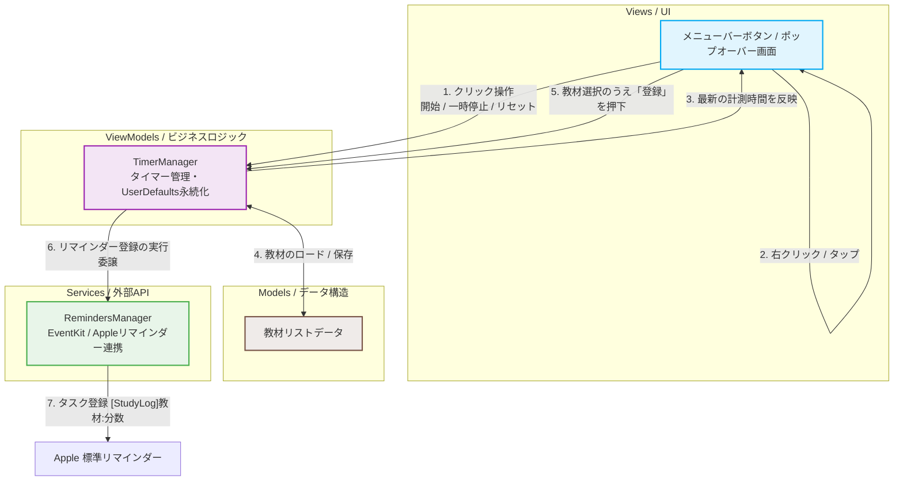

# StudyTimer ⏳🍏

Macのメニューバーで動作する、ストップウォッチ兼勉強記録アプリです。Apple標準のリマインダーアプリとシームレスに連携します。

## 🌟 主な機能
- **メニューバー常駐型:** クリーンでダークモードに最適化されたUIで、Macのメニューバー上だけで動作します。
- **直感的なクリック操作:**
  - **シングルクリック (左クリック):** タイマーの「開始」および「一時停止」。
  - **高速ダブルクリック (左ダブルタップ):** タイマーを「00:00」にリセット。
- **後から教材を選択・登録:** 右クリック (二本指タップ) でポップアップを開き、計測した勉強時間の対象となる教材を選択できます。教材リストの追加・削除などの管理も可能です。
- **Appleリマインダー連携:** 計測した勉強時間を、厳密なフォーマット `[StudyLog]教材名:分数` (例: `[StudyLog]Java:45`) でMac標準のリマインダーアプリに直接登録します。1時間を超えた場合も自動的に「分」に換算されて出力されます（例: 1時間20分 ➔ `[StudyLog]資格の勉強:80`）。

## 🛠️ 技術スタック
- **OS:** macOS 14+
- **開発言語:** Swift / SwiftUI
- **連携フレームワーク:** EventKit (Appleリマインダー連携用)

## 🏗️ アーキテクチャ (Architecture)

本プロジェクトは、機能の分離、テスト容易性、および保守性を確保するために、**MVVM (Model-View-ViewModel)** アーキテクチャパターンを採用しています。

### 📊 システム連携・データフロー図
以下は、GitHub上で美しくレンダリングされる、アプリ内の処理とデータの流れを示したフロー図です：

### 📁 ディレクトリ構成とコンポーネント構成

- **`Views/` (表示層)**
  - `MainPopoverView` / `HeaderView` / `TimerDisplayCard`: UIのレイアウト、グラスモーフィズムなどのスタイリング、およびユーザー操作（クリック）を受け付けます。ViewModelを監視し、リアルタイムにタイマーの表示を更新します。
- **`ViewModels/` (制御層)**
  - `TimerManager` (本アプリのメイン頭脳): ストップウォッチの状態（開始、一時停止、リセット）を管理し、1秒ごとのタイマーを駆動し、`UserDefaults` を使って教材リストのデータを永続化します。
- **`Models/` (データ層)**
  - `Materials`: ユーザーが追加・削除可能なカスタム教材（学習カテゴリ）を表すデータ構造です。
- **`Services/` (サービス連携層)**
  - `RemindersManager`: Appleの **EventKit** フレームワークとのすべての連携をカプセル化します。ユーザーへのアクセス権限の要求や、指定されたフォーマットでの標準リマインダーアプリへの登録処理を安全に実行します。

### 🔄 処理フローの概要
1. **ユーザーの操作:** メニューバーボタンへの左クリック（シングル・ダブル）や右クリック操作によってイベントが検知されます。
2. **状態管理:** ビューが検知した操作を `TimerManager` に伝え、タイマーの状態や秒数が更新されます（ビューは `@Published` で自動検知しリアルタイム描画されます）。
3. **外部リマインダー登録:** ユーザーが教材を選択して「リマインダーに登録してリセット」ボタンを押すと、ViewModelがデータを検証し、バックグラウンドで `RemindersManager` に委譲され、Apple標準のリマインダーアプリに `[StudyLog]教材名:分数` 形式でタスクとして安全に登録されます。

## 🔒 セキュリティとプライバシー
このアプリはすべてのデータをMacローカル上で処理します。リマインダーへのアクセス権限は、お客様個人のAppleリマインダーアプリへ学習ログを登録する目的のみに使用されます。
